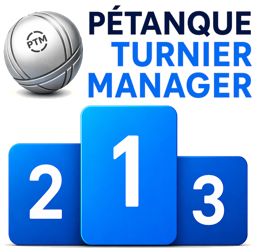

# Pétanque Turnier Manager Online

> *Gebaut mit der Präzision eines Informatikers und der Leidenschaft eines Boulers.*

## 🎯 Pétanque-Turniere online organisieren

Der **Pétanque Turnier Manager Online** ergänzt den
[Pétanque-Turnier-Manager für LibreOffice Calc](https://github.com/michaelmassee/Petanque-Turnier-Manager)
um eine moderne, browserbasierte Turnierplattform. Turnierleiter verwalten
Turniere, Anmeldungen und Teilnehmer direkt im Browser; Spieler finden offene
Turniere und melden sich unkompliziert über Handy, Tablet oder PC an.

Die Anwendung ist als installierbare Progressive Web App ausgelegt. Die
konfigurierte Produktionsadresse ist [ptmonline.org](https://ptmonline.org/).
Die Oberfläche ist verfügbar in Deutsch, Niederländisch, Englisch, Spanisch
und Französisch.

**Vorteile auf einen Blick:**

* **Einfach anmelden:** Öffentliche Turniere finden, Details ansehen und direkt online melden.
* **Für Turnierleiter gemacht:** Anmeldungen prüfen, bestätigen, Wartelisten verwalten und Teilnehmer exportieren.
* **Mobil nutzbar:** Als PWA installierbar und für den Einsatz am Bouleplatz optimiert.
* **Mehrsprachig:** DE, NL, EN, ES und FR sind direkt in der Anwendung umschaltbar.
* **Sicher aufgebaut:** Sitzungen, Rollen, API-Schlüssel und Eingaben werden serverseitig abgesichert.
* **Offen verbunden:** Autorisierte Turnierprogramme können Turniere, Meldungen und Ergebnisse über die API synchronisieren.

---

## 🏆 Funktionen

### 📅 Turniere entdecken und veröffentlichen

* Öffentliche Turnierübersicht mit Suche, Filtern und Umkreissuche
* Turnierdetails mit Ort, Startzeit, Spielsystem, freien Plätzen und Kontakt
* Öffentliche oder private Turniere mit teilbaren Anmeldelinks
* Vereine und Bouleplätze auf einer Karte entdecken und Turnieren zuordnen

### 📝 Anmeldungen ohne Papierchaos

* Anmeldung für Tête-à-tête, Doublette und Triplette
* Unterstützung für Forme, Mêlée und Supermêlée
* Bestätigte Anmeldungen, Freigabe durch die Turnierleitung und Wartelisten
* Startgeld-Tarife, Lizenzpflicht, Teamnamen und private Hinweise an die Turnierleitung
* E-Mail-Bestätigungen, Erinnerungen und Stornierung über einen sicheren Link

### 🎯 Turnierverwaltung und Live-Spielbetrieb

* Turniere direkt online anlegen und bearbeiten
* Teilnehmer verwalten, CSV exportieren und manuell ergänzen
* Schweizer System und Mêlée/Supermêlée online durchführen
* Runden auslosen, Ergebnisse eintragen und Ranglisten live anzeigen
* Interne Postbox, Aufgabenhinweise und Push-Benachrichtigungen

### 🔗 Gemeinsam mit dem Desktop-Programm

Der Pétanque-Turnier-Manager Online kann eigenständig verwendet werden oder
mit dem Desktop-Projekt verbunden werden. Über freigegebene API-Schlüssel
können berechtigte Turnierleiter Turnierdaten übertragen sowie Anmeldungen und
Ergebnisse synchronisieren.

---

## 🚀 Direkt loslegen

1. Öffne [ptmonline.org](https://ptmonline.org/).
2. Suche ein öffentliches Turnier oder erstelle ein Benutzerkonto.
3. Melde dich an oder verwalte als Turnierleiter dein eigenes Turnier.
4. Installiere die App bei Bedarf über das Browser-Menü auf deinem Gerät.

> **💡 Für Veranstalter:** Ein Turnier kann mit wenigen Angaben angelegt werden.
> Danach steuerst du Anmeldung, Teilnehmerliste und Kommunikation zentral an
> einem Ort.

## 🤝 Mitwirken

Fehlerberichte, Ideen und Pull Requests sind willkommen. Bitte beachte vor
einem Beitrag die Hinweise in [CONTRIBUTING.md](CONTRIBUTING.md). Sicherheitslücken
gehören nicht in öffentliche Issues; hierfür gilt der Meldeweg aus
[SECURITY.md](SECURITY.md).

## ❤️ Unterstützung

Wenn dir der Pétanque-Turnier-Manager hilft, freue ich mich über eine
[Unterstützung via PayPal](https://www.paypal.me/michaelmassee1).
